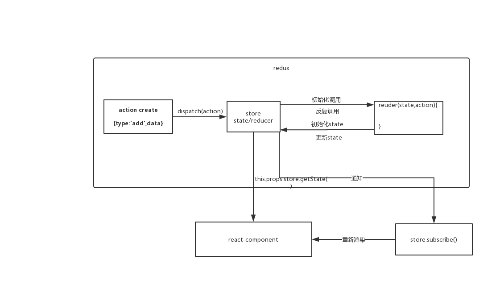

## 简介

- src-counter-react-redux :使用 react-redux 实现状态管理
- src-counter-react :使用 react 实现状态管理
- src-count-redux:使用 redux 实现状态管理
- src-min-redux:使用自定义的 redux 实现状态管理，了解 redux 的内部实现

### 什么是 redux

```shell
yarn add redux
```

1. redux 是一个独立专门用于做状态管理的 js 库(不是 react 的插件库)
2. 作用：集中式管理 react 应用中多个组件共享的状态

#### 原理



#### redux 的三个核心概念

##### action

1. 标识要执行行为的对象
2. 包含 2 个方面的属性
   1. type:标识属性，值为字符串，唯一，必要属性
   2. xxx:数据属性，值任意类型，可选属性
3. 例子： const action = {type:"ADD",data:2}

##### reducer

1. 根据老的 state 和 action ,产生新的 state 的纯函数
2. 注意：返回一个新的状态，不要直接修改老状态

##### store

1. 将 state ,action 与 reducer 联系在一起的对象

#### redux 重要方法

- this.props.store.getState() 获取 redux 管理的状态
- this.props.store.dispatch(action) 发布任务，修改 redux 管理的状态
- this.store.subscribe() 监听 redux 管理的状态的改变，用于渲染组件

### react-redux

- 一个 react 插件库
- 专门用来简化 react 应用中使用 redux

```shell
yarn add react-redux
```

#### 将所有组件分成两大类

1. 容器组件：负责和 redux store
   1. 负责管理数据和业务逻辑，不负责 UI 呈现
   2. 使用 redux 的 API
   3. 一般保存在 containers 文件夹下
2. UI 组件：
   1. 只负责 UI 的呈现，不带有任何业务逻辑代码
   2. 通过 props 接收数据
   3. 不使用任何 redux 的 API
   4. 一般保存在 components 文件夹下

##### 文件夹基础结构

- redux/action-types.js
- redux/actions.js
- redux/reducers.js
- redux/store.js

### redux 异步编程

redux 是 redux 插件(异步中间件)，用于在 redux 中进行异步处理

```shell
yarn add react-thunk
```

### redux 调试工具

```shell
yarn add redux-devtool-extension
```

### 管理多个 reducer 函数

```js
import { combineReducers } from "redux";

export default combineReducers({
  counter
});
```

### 自定义 redux 与 react-redux

#### 自定义 redux 库

了解 redux 内部实现原理

1. redux 对外暴露的核心几个函数
   1. createStore()
   2. combineReducers()
   3. applyMiddleware()
2. store
   1. getState() 返回内部保存的 state 对象
   2. dispatch() 参数为 action 对象
   3. subscribe() 参数为监听内部 state 更新的回调函数

#### 自定义 react-redux 库

使用 react-redux 简化 redux 的编写

1. react-redux 向外暴露的接口
   1. Provider 组件
   2. connect() 函数
2. Provider
   1. 接收 store 属性
   2. 让所有容器组件都可以看到 store,从而通过 store 读取/更新状态
3. connect()
   1. 接收 2 个参数：mapStateToProps , mapDispatchToProps
   2. mapStateToProps :向 UI 组件 props 传递一般属性
   3. mapDispatchToProps:向 UI 组件 props 传递函数属性
   4. connect() 执行的返回值为一个高阶组件：包装 UI 组件，返回一个新的容器组件，组件会向 UI 组件传递一般/函数属性
